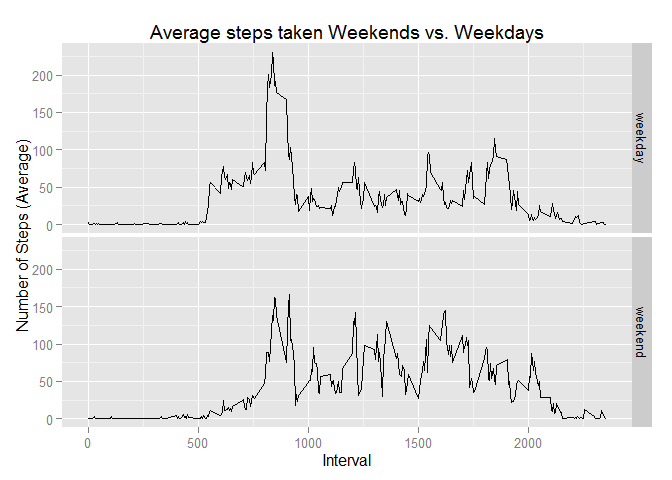

# Reproducible Research Peer Assesment 1

##About the Data

The data for this assignment can be downloaded from the course web site:
  
Dataset: [Activity monitoring data](https://d396qusza40orc.cloudfront.net/repdata%2Fdata%2Factivity.zip) [52K]  
The variables included in this dataset are:  

- steps: Number of steps taking in a 5-minute interval (missing values are coded as NA)  

- date: The date on which the measurement was taken in YYYY-MM-DD format  

- interval: Identifier for the 5-minute interval in which measurement was taken  

The dataset is stored in a comma-separated-value (CSV) file and there are a total of 17,568 observations in this dataset.  
  
##Load and clean the data


```r
RawData<-read.csv("./activity/activity.csv")

# Convert date variable from factor to date, and remove NAs
CleanData <- na.omit(RawData)
CleanData$date <- as.Date(CleanData$date)
```
  
    
      
        
##Q1: What is mean total number of steps taken per day?  
  
    
####1. Calculate the total number of steps taken per day.  

```r
#load the dplyr package for grouping and summarizing
library(dplyr)  
```

```r
# 1. Build the summary table for total steps per day
StepsPerDay <- CleanData %>% group_by(date) %>% summarise(TotalSteps = sum(steps))
StepsPerDay
```

```
## Source: local data frame [53 x 2]
## 
##          date TotalSteps
##        (date)      (int)
## 1  2012-10-02        126
## 2  2012-10-03      11352
## 3  2012-10-04      12116
## 4  2012-10-05      13294
## 5  2012-10-06      15420
## 6  2012-10-07      11015
## 7  2012-10-09      12811
## 8  2012-10-10       9900
## 9  2012-10-11      10304
## 10 2012-10-12      17382
## ..        ...        ...
```
  
    
####2. Make a histogram of the total number of steps taken each day.  

```r
# 2. Plot a histogram of the StepsPerDay summary table
hist(StepsPerDay$TotalSteps, 
     xlab="Total steps per day", 
     ylab="Count", 
     main="Histogram of total number of steps taken per day",
     col="red")
```

 
  
    
####3. Calculate and report the mean and median of the total number of steps taken per day.  

```r
meanstepsperday <- format(mean(StepsPerDay$TotalSteps), scientific = FALSE)
medianstepsperday <- median(StepsPerDay$TotalSteps)
```
Mean Steps per Day:    **10766.19**  
Median Steps per Day:  **10765**  
  
    
      
        
##Q2:What is the average daily activity pattern?  
  
    
####1. Make a time series plot (i.e. type = "l") of the 5-minute interval (x-axis) and the average number of steps taken, averaged across all days (y-axis).  

```r
# Group and summarize the CleanData by interval
StepsperInterval <- CleanData %>% group_by(interval) %>% summarise(meanstepsperinterval = mean(steps))

plot(StepsperInterval$interval, StepsperInterval$meanstepsperinterval, 
     type = 'l',
     xlab = "Five minute interval",
     ylab = "Average number of steps",
     main = "Average Steps by Five Minute Interval Across All Days")
```

 
  
    
####2. Which 5-minute interval, on average across all the days in the dataset, contains the maximum number of steps?

```r
# Find the interval with max average
maxaverage<- StepsperInterval[StepsperInterval$meanstepsperinterval==max(StepsperInterval$meanstepsperinterval), 1]
```
The 5-minute interval with the maximum number of steps is maxaverage = **835**  
  
    
      
        
##Q3: Imputing missing values  
Note that there are a number of days/intervals where there are missing values (coded as NA). The presence of missing days may introduce bias into some calculations or summaries of the data.  
  
    
####1. Calculate and report the total number of missing values in the dataset (i.e. the total number of rows with NAs)  

```r
# Total number of missing steps
missingsteps <- sum(is.na(RawData$steps))
```
The total number of missing steps is **2304**  
  
    
####2. Devise a strategy for filling in all of the missing values in the dataset. The strategy does not need to be sophisticated. For example, you could use the mean/median for that day, or the mean for that 5-minute interval, etc.   
*Use the mean for the 5-minute interval to fill the NAs*  
  
      
####3. Create a new dataset that is equal to the original dataset but with the missing data filled in. 

```r
#find the indices with NA
intervalwithna<-which(is.na(RawData$steps))

#copy the RawData 
fulldata<-RawData

for(i in intervalwithna){
        #replace the NA steps with the mean for the time interval
        fulldata[i,1]<- StepsperInterval[StepsperInterval[,1]==fulldata[i,3],2]
        
}
#have to convert date as I did for CleanData
fulldata$date<-as.Date(fulldata$date)
```
  
    
####4. Make a histogram of the total number of steps taken each day and Calculate and report the mean and median total number of steps taken per day. Do these values differ from the estimates from the first part of the assignment? What is the impact of imputing missing data on the estimates of the total daily number of steps?

```r
#group and summarize the data
StepsPerDayFull <- fulldata %>% group_by(date) %>% summarise(TotalSteps = sum(steps))

# Plot a histogram of the StepsPerDayFull summary table
hist(StepsPerDayFull$TotalSteps, 
     xlab="Total steps per day", 
     ylab="Count", 
     main="Histogram of total number of steps taken per day",
     col="red")
```

 

```r
# Report the mean and median of the total numer of steps taken per day. 
meanstepsperdayfull <- format(mean(StepsPerDayFull$TotalSteps), scientific = F)
medianstepsperdayfull <- format(median(StepsPerDayFull$TotalSteps), scientific = F)
```
  
Comparison:
Mean Steps per Day  
        * with NAs:     **10766.19**  
        * filled NAs:   **10766.19**  
  
Median Steps per Day  
        * with NAs: **10765**  
        * filled NAs: **10766.19**   
          
So, the mean stayed the same and the median changed to equal the mean.
  
    
      
        
##Q3: Are there differences in activity patterns between weekdays and weekends?
  
    
####1. Create a new factor variable in the dataset with two levels â<U+0080><U+0093> â<U+0080><U+009C>weekdayâ<U+0080> and â<U+0080><U+009C>weekendâ<U+0080> indicating whether a given date is a weekday or weekend day.  

```r
fulldata$dayofweek <- weekdays(fulldata$date)
fulldata$dayofweektype <- "weekday"
fulldata$dayofweektype[fulldata$dayofweek %in% c("Saturday", "Sunday")] <- "weekend"
```
  
    
####2. Make a panel plot containing a time series plot (i.e. type = "l") of the 5-minute interval (x-axis) and the average number of steps taken, averaged across all weekday days or weekend days (y-axis). See the README file in the GitHub repository to see an example of what this plot should look like using simulated data. 

```r
#build the aggregate
dayofweektypeaverage <- fulldata %>%
    group_by(dayofweektype, interval) %>%
    summarize(AverageSteps=mean(steps))

#plot the data using ggplot2
library(ggplot2)
qplot(interval, AverageSteps, data=dayofweektypeaverage,
      type="l",
      geom="line",
      xlab="Interval",
      ylab="Number of Steps (Average)",
      main="Average steps taken Weekends vs. Weekdays",
      facets =dayofweektype ~ .)
```

 
  
Conclusion: Looks like activity is lower in the morning on the weekends-go figure.
